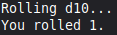
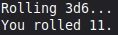
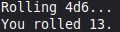
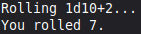
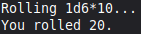
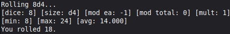

# dice-roller

This is a terminal-based dice rolling application built in C.
It allows users to provide typical dice roll expressions (such as 2d8+3) and the application will parse the expression with regex to extract the necessary parameters to roll (number of dice: 2, size of dice: d8, total modifier: +3) then randomly roll against those parameters and print the result to screen.

## Features

- Simulates dice rolls for typical roll expressions
- Optionally drop the lowest/highest die from the final result
- Add a modifier to each individual die
- Print roll arguments and statistics to the screen.

## Requirements

- C compiler (such as gcc)

# Installation

1. Clone the repository:

```
git clone https://github.com/djm858/dice-roller.git
```

2. Navigate to the project directory:

```
cd dice-roller
```

3. Compile the program with the provided make file:

```
make roll
```

## Operation

1. Run the program with a roll expression and optional arguments:

- Roll a single 10-sided die:
```
./roll d10
```


- Roll three (3) 6-sided dice:
```
./roll 3d6
```


- Roll four (4) 6-sided dice and drop the lowest value:
```
./roll 4d6 -d low
```


- Roll damage for a two-handed sword with a Strength modifier of +2:
```
./roll 1d10+2
```


- Roll the encounter size of a group of bandits in the wild:
```
./roll 1d6*10
```


- Roll the HP of an 8th-level Magic-User with a Constitution modifier of -1 in verbose mode:
```
./roll 8d4 -m -1 -v
```


## Uninstall

1. Remove the program with the provided make file:

```
make clean
```
